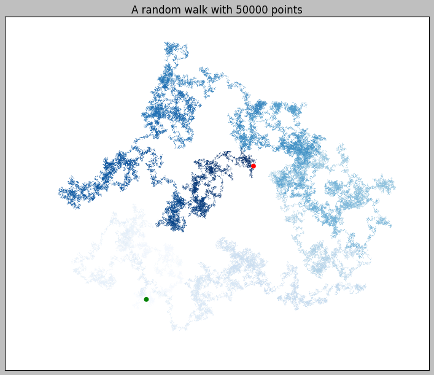
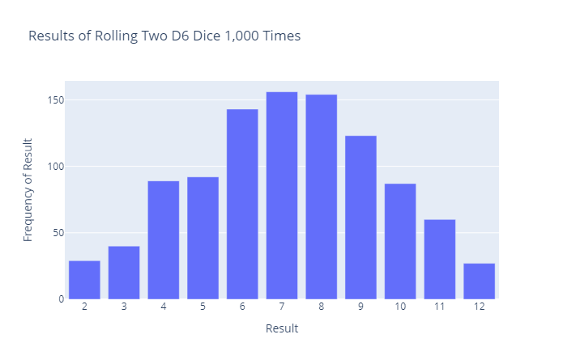

# Data Visualization

## A Random Walk with 50000 points. [➡️](https://github.com/fidelysla/data_visualization/blob/main/random_walks.ipynb)

## Rolling Dice. [➡️](https://github.com/fidelysla/data_visualization/blob/main/rolling_dice.ipynb)

## Sitka Weather - Death Valley. [➡️](https://github.com/fidelysla/data_visualization/blob/main/sitka_weather.ipynb)

## Mapping Global Earthquake Datasets. [➡️](https://github.com/fidelysla/data_visualization/blob/main/eq_map_dataset.ipynb)

